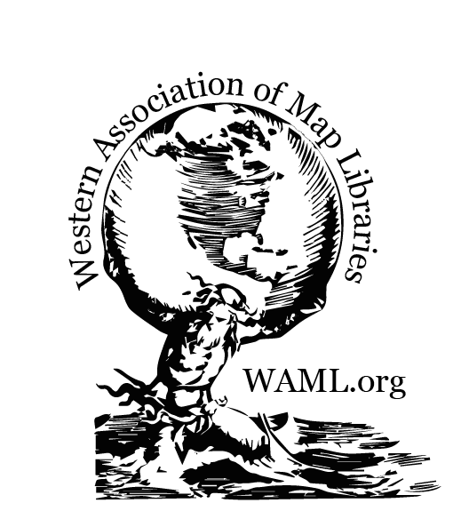

# Adding images to your page

#### Adding an image is super easy! Here are a few methods
[View the source Markdown for this page](https://raw.githubusercontent.com/ubc-lib-geo/gis-workshop-waml-template/master/content/examples/images.md)

___

**Add an image from the web:**

Start an in-line link with an exclamation point then place the alt text in the brackets followed by the image link in the parentheses:

``


You can also add images "reference style." This is handy if you don't want to clutter up your Markdown. You can just place the references at the bottom of the page. It goes like this:

```
![Point Sublime][Sublime]

[Sublime]: http://www.waml.org/groundwork-master/images/grndcnyn.jpg
```

![Point Sublime][Sublime]

Nice job!

___  

**Add an image from your directory:**

You can also add images from a file directory. If you're using GitHub Pages, that means you would want a folder where your content or images live in your GitHub repository. The syntax is the same, except replace the link with the path to the image:

``



Sweet!

___

**Add a different format:**

Want to put a gif in there? No problem!

``


_Note: "gif" is pronounced with a hard "g"_

___

**Link an image:**

To link an image, you just need to embed the image syntax within the syntax for a hyperlink:

Here's a regular link:

`[WAML Conference 2020](http://www.waml.org/conf)`

[WAML Conference 2020](http://www.waml.org/conf)

Here's a linked image:

`[](http://www.waml.org/conf)`

[](http://www.waml.org/conf)

_Click Me!_

So easy, right?!

____

**Need to get extra fancy?**

You can also add html directly to Markdown. Say you wanted to change the size of an image, for example.

``


Aren't you so fancy!!


<!--reference links-->
[Sublime]: http://www.waml.org/groundwork-master/images/grndcnyn.jpg
